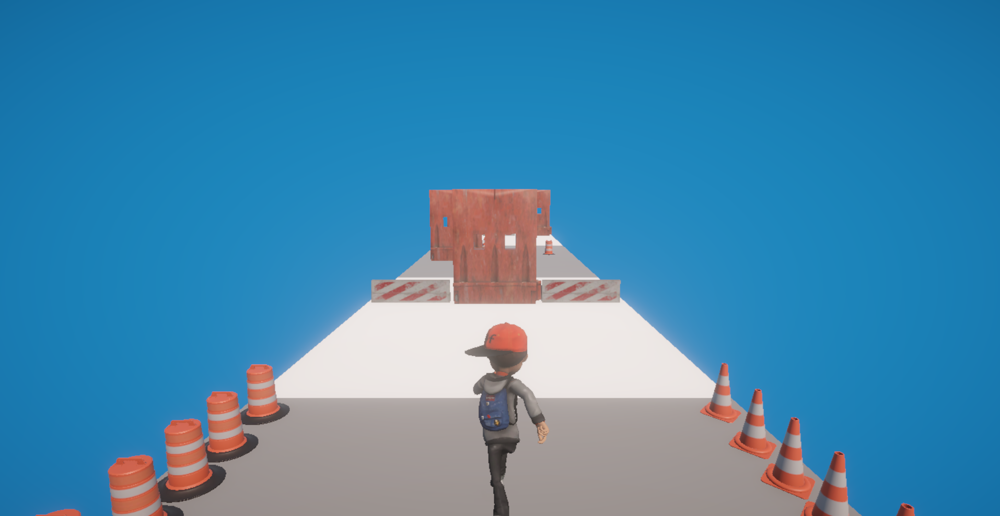

# 🏃‍♂️ Endless Runner Game 🎮

### - Developed by Özgür Kadakal

**⚠️ Önemli:** İndirdiğiniz `.zip` dosyasını ayıklayıp projeyi bu şekilde açınız. Aksi takdirde proje düzgün şekilde çalışmayabilir.  

**⚠️ Important:** Please extract the downloaded `.zip` file before opening the project. Otherwise, it may not work properly.  

---

## 🖼️ Gameplay Previews

### 🎮 In-Game Screenshot 1

### 🎮 In-Game Screenshot 2

### 🎮 In-Game Screenshot 3

---

## 🌍 English

### 🏃 Endless Runner Game
An endless running game developed in Unity by Özgür Kadakal, featuring random obstacle generation, animations, and immersive sound effects.

### ✨ Features
- 🎯 Endless running player character
- ⚠️ Randomly generated obstacles for each run
- 💥 Collision animations and sound effects
- 🎵 Action-packed background music during gameplay
- 🖱 Game Over screen with "Try Again" button
- 🏃 Character jump, run, and fall animations
- 🎮 3D character model and smooth controls

---

## 🇹🇷 Türkçe

### 🏃 Sonsuz Koşu Oyunu
Unity ile Özgür Kadakal tarafından geliştirilmiş, rastgele engeller ve çeşitli animasyonlar içeren eğlenceli bir sonsuz koşu oyunu.

### ✨ Özellikler
- 🎯 Sonsuz koşan karakter
- ⚠️ Her oynayışta rastgele oluşan engeller
- 💥 Çarpışma animasyonları ve sesleri
- 🎵 Oyun sırasında aksiyon müziği
- 🖱 Game Over ekranı ve "Try Again" butonu
- 🏃 Karakterin zıplama, koşma, düşme animasyonları
- 🎮 3D karakter modeli ve akıcı kontroller

---

## 🛠 Unity Version | Unity Sürümü

- **2022.3.62f1**  
> This project was developed and tested with **Unity 2022.3.62f1**.  
> Proje, **Unity 2022.3.62f1** sürümü ile geliştirilmiş ve test edilmiştir. Aynı veya uyumlu bir sürümle açmanız tavsiye edilir.

---

## ⚠️ Important Notice | Önemli Uyarı

- **English:**  
  1. When opening the project through Unity Hub for the first time, loading may take a long time. This is normal as Unity will rebuild the Library folder.  
  2. On the first project launch, you will see an **empty scene** (no objects in the Hierarchy).  
     To load the game objects, go to the **`Assets/Scenes/`** folder and double-click on **`SampleScene`**.  
     Alternatively, you can open **SampleScene** directly from Unity Hub by double-clicking it in the **Project window** once the project has loaded.  
     Once loaded, the game will be ready to use.

- **Türkçe:**  
  1. Projeyi Unity Hub üzerinden ilk kez açarken yüklenme süresi uzun olabilir. Bu normaldir çünkü Unity, Library klasörünü yeniden oluşturacaktır.  
  2. Proje ilk açıldığında **Hierarchy tamamen boş** görünecektir (hiç obje olmayacaktır).  
     Oyun objelerini yüklemek için **`Assets/Scenes/`** klasörüne gidip **`SampleScene`** dosyasına çift tıklayın.  
     Alternatif olarak, proje yüklendikten sonra Unity Hub içerisindeki **Project penceresinden** de **SampleScene**’i çift tıklayarak açabilirsiniz.  
     Yüklendikten sonra oyun kullanıma hazırdır.

📸 **Screenshot:**  

---

## 📬 Contact | İletişim

For any feedback, questions, or suggestions, feel free to contact me:  
📧 ozgurkadakal61@gmail.com

Her türlü geri bildirim, soru veya öneri için:  
📧 ozgurkadakal61@gmail.com
