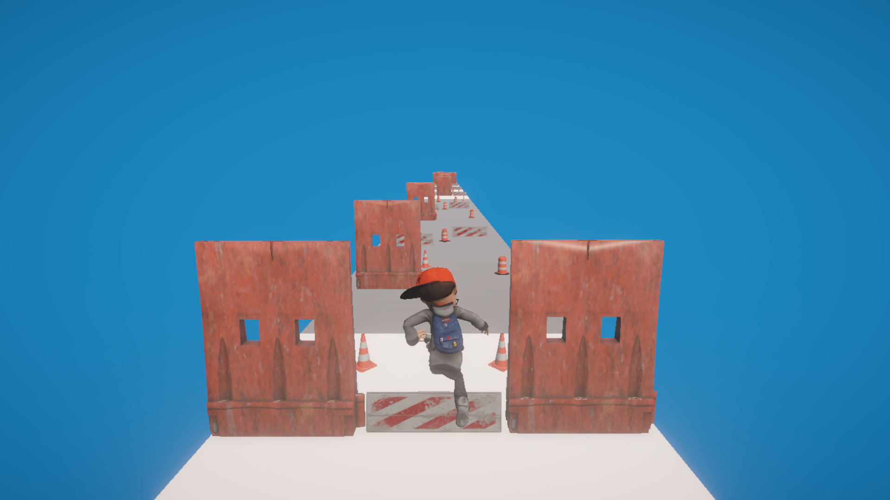
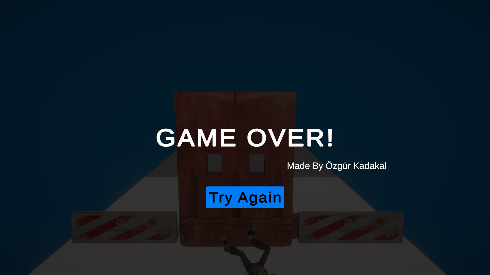
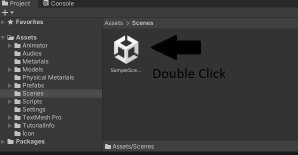
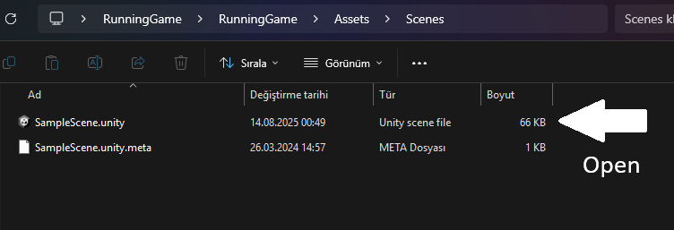

## 🌍 English

# 🏃‍♂️ Endless Runner Game 🎮

### - Developed by Özgür Kadakal

**⚠️ Important:** Please extract the `.zip` file before opening the project. Otherwise, it may not work properly.

---

## 🖼️ Gameplay Previews

### 🎮 In-Game Screenshot 1

### 🎮 In-Game Screenshot 2

### 🎮 In-Game Screenshot 3

---

### 🏃 Endless Runner Game
An endless running game developed in Unity by **Özgür Kadakal**, featuring random obstacle generation, smooth animations, and immersive sound effects.

### ✨ Features
- 🎯 Endless running player character  
- ⚠️ Randomly generated obstacles for each run  
- 💥 Collision animations and sound effects  
- 🎵 Action-packed background music  
- 🖱 Game Over screen with "Try Again" button  
- 🏃 Character jump, run, and fall animations  
- 🎮 3D character model and smooth controls

🧑‍💻 *This project was developed from scratch by Özgür Kadakal.*  
📌 *All code and assets are original.*

---

## 🛠 Unity Version

- **2022.3.62f1**  
> This project was developed and tested with **Unity 2022.3.62f1**.

---

## ⚠️ Important Notice

1. First-time loading through Unity Hub may take long. This is normal as Unity rebuilds the Library folder.  
2. On first launch, the Hierarchy may appear empty.  
   Open **`Assets/Scenes/SampleScene`** to load the game objects.

📸 **Screenshots:**  

  

---

## 📬 Contact

For any feedback, questions, or suggestions, contact me:  
📧 ozgurkreach@gmail.com

---

## 🇹🇷 Türkçe

# 🏃‍♂️ Sonsuz Koşu Oyunu 🎮

### - Geliştirici: Özgür Kadakal

**⚠️ Önemli:** `.zip` dosyasını açmadan önce ayıklayın, aksi halde proje düzgün çalışmayabilir.

---

## 🖼️ Oynanış Önizlemeleri

### 🎮 Oyun İçi Görüntü 1

### 🎮 Oyun İçi Görüntü 2

### 🎮 Oyun İçi Görüntü 3

---

### 🏃 Sonsuz Koşu Oyunu
Unity ile **Özgür Kadakal** tarafından geliştirilmiş, rastgele engeller, akıcı animasyonlar ve etkileyici ses efektleri içeren bir sonsuz koşu oyunu.

### ✨ Özellikler
- 🎯 Sonsuz koşan karakter  
- ⚠️ Her oynayışta rastgele oluşan engeller  
- 💥 Çarpışma animasyonları ve ses efektleri  
- 🎵 Aksiyon dolu arka plan müziği  
- 🖱 Game Over ekranı ve "Try Again" butonu  
- 🏃 Karakterin zıplama, koşma ve düşme animasyonları  
- 🎮 3D karakter modeli ve akıcı kontroller

🧑‍💻 *Bu proje Özgür Kadakal tarafından sıfırdan geliştirilmiştir.*  
📌 *Tüm kodlar ve içerikler özgündür.*

---

## 🛠 Unity Sürümü

- **2022.3.62f1**  
> Proje **Unity 2022.3.62f1** sürümü ile geliştirilmiş ve test edilmiştir.

---

## ⚠️ Önemli Uyarı

1. Unity Hub ile ilk yükleme uzun sürebilir. Bu normaldir çünkü Unity Library klasörünü yeniden oluşturur.  
2. İlk açılışta Hierarchy boş görünebilir.  
   Oyun objelerini yüklemek için **`Assets/Scenes/SampleScene`** dosyasını açın.

📸 **Ekran Görüntüleri:**  

  

---

## 📬 İletişim

Her türlü geri bildirim, soru veya öneri için:  
📧 ozgurkreach@gmail.com
